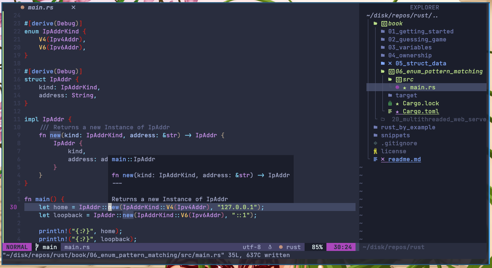
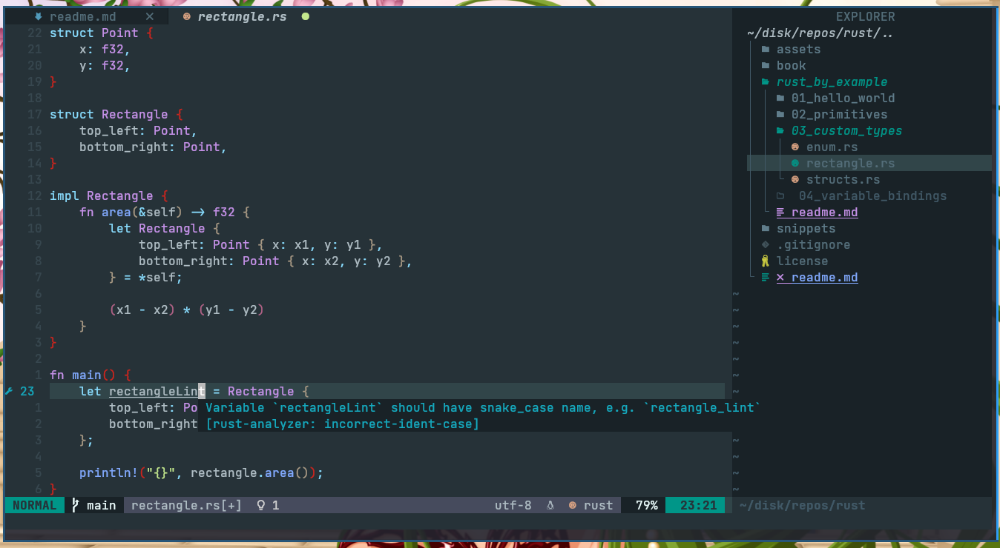

# rust playground

A language empowering everyone to build reliable and efficient software.

## Resources

- [The Book](https://doc.rust-lang.org/book)

- [Rustlings](https://github.com/rust-lang/rustlings)

- [Rust by Example](https://doc.rust-lang.org/stable/rust-by-example)

- [Take your first steps with Rust](https://docs.microsoft.com/en-us/learn/paths/rust-first-steps)

- [Getting started with Rust](https://stackoverflow.blog/2021/03/15/getting-started-with-rust)

## Cool Rust Related Questions

- [How is Rust compiled to machine code?](https://stackoverflow.com/questions/43385142)

- [Why does printing a pointer print the same thing as printing the dereferenced pointer?](https://stackoverflow.com/questions/27852613)

## Editor Setup

I use [Neovim](https://neovim.io),
[config](https://github.com/UltiRequiem/UltiVim).

> I'm usign [rust-analyzer](https://github.com/fannheyward/coc-rust-analyzer)
> for autocomplete, docs, code actions, formatting, etc

## License

All here is licensed under the MIT License.
